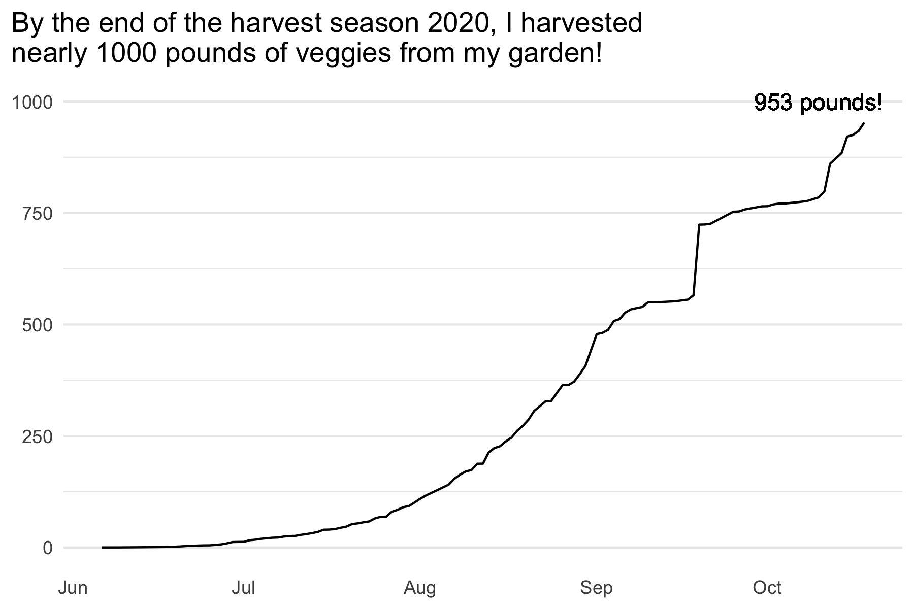
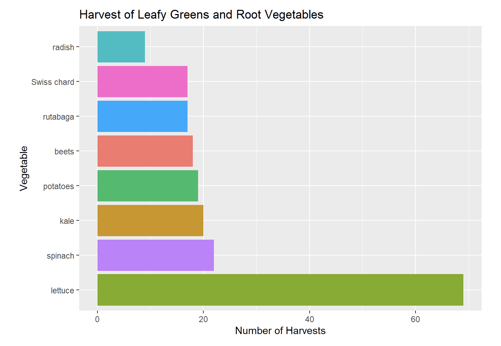

background-image: url(images/IMG_0952.jpg)
background-size: cover
background-position: 50% 50%
class: left, top, inverse

# Jungle Garden

```{css, echo = FALSE}
.title-slide {
  background-image: url(images/top_view.jpg);
  background-size: cover;
}
.title-slide .remark-slide-number {
  display: none;
}
```


```{r setup, include=FALSE}
options(htmltools.dir.version = FALSE)
knitr::opts_chunk$set(echo = FALSE, 
                      message = FALSE, 
                      warning = FALSE)
```

```{r library-me}
library(xaringan)
library(xaringanExtra)
library(tidyverse)
library(gardenR)
library(lubridate)
```


???


Welcome to my garden. Before I talk about how I use data from it in my intro course, I want to tell you a little bit about how my garden came to be. 

I started gardening in the summer of 2004, the first year I had a house with a backyard. I don't have a picture from back then, but here's one from 2013. Perhaps it gives you a sense of why I fondly refer to it as the jungle garden?


---

background-image: url(images/IMG_8551.jpg)
background-size: cover
background-position: 50% 50%
class: left, top, inverse

# Starting over

???

In 2017, my family and I moved. So, in 2018, I needed to start fresh.

---

background-image: url(images/IMG_8619.jpg)
background-size: cover
background-position: 50% 50%
class: left, top, inverse


???

We made boxes for raised beds and built a fence to keep all the rabbits out!

---

background-image: url(images/IMG_8879.jpg)
background-size: cover
background-position: 50% 50%
class: left, top, inverse


???

I laid A LOT of bricks for paths.

---

background-image: url(images/IMG_0446.jpg)
background-size: cover
background-position: 50% 50%
class: left, top, inverse


???

By May of 2019, things were really shaping up (and my forearms were quite sore from lifting all those bricks!). 

---

background-image: url(images/IMG_2800.jpg)
background-size: cover
background-position: 50% 50%
class: left, top, inverse


???

This photo is from June 2020, with the garden just starting to bloom. 
---

background-image: url(images/IMG_2985.jpg)
background-size: cover
background-position: 50% 50%
class: left, top, inverse


???

I love spending time in my garden. 

---

background-image: url(images/IMG_2987.jpg)
background-size: cover
background-position: 50% 50%
class: left, top, inverse


???

And this new one has lived up to the jungle garden name of its predecessor. 

---

background-image: url(images/IMG_3017.jpg)
background-size: cover
background-position: 50% 50%
class: left, top, inverse


???

The pumpkin/squash arch is my favorite feature and is abuzz with bees most of the summer. 

---

background-image: url(images/IMG_3065.jpeg)
background-size: cover
background-position: 50% 50%
class: left, top, inverse


???

It's a fairly productive garden, too!

---

background-image: url(images/IMG_2993.jpg)
background-size: cover
background-position: 50% 50%
class: left, top, inverse


???

I preserve and eat as much as I can.

---

background-image: url(images/IMG_3048.jpg)
background-size: cover
background-position: 50% 50%
class: left, top, inverse


???

And share with others, too. That's zucchini bread, if you're wondering.

---

```{r, eval=FALSE}

cum_harvest <-
  garden_harvest %>% 
  group_by(date) %>% 
  summarize(wt_pounds = sum(weight)*0.00220462) %>% 
  mutate(cum_wt_pounds = cumsum(wt_pounds)) %>% 
  ggplot() +
  geom_line(aes(x = date,
                y = cum_wt_pounds)) +
  geom_text(aes(x = ymd("2020-10-10"),
                y = 1000,
                label = paste(round(max(cum_wt_pounds),0),
                              "pounds!"))) +
  labs(x = NULL,
       y = NULL,
       title = "By the end of the harvest season 2020, I harvested \nnearly 1000 pounds of veggies from my garden!") +
  theme_minimal() +
  theme(plot.title.position = "plot", 
        panel.grid.major.x = element_blank(),
        panel.grid.minor.x = element_blank())

ggsave("images/cum_harvest.png",
       cum_harvest, 
       width = 6,
       height = 4)
```


```{r, fig.align='center'}

```


???

Last year, I harvested nearly 1000 pounds of food from the garden! Which reminds me ... I'm supposed to be talking to you about using the data in my class. Let's get to that.

---

# Garden data

* Why use data from the garden?  

  - I could use it to teach a lot of intro data science topics.  
  - It's interesting (at least I think it is).  
  - Personal connection.  
  - Why not?!  
  

* How?

  - Google sheet and later an R package called [gardenR](https://github.com/llendway/gardenR): https://github.com/llendway/gardenR
  - To introduce new functions & for a perfect garden graph assignment

???

Sometime in the spring of 2020, I realized that I could combine my love of my garden with my love of data by collecting data about my garden to use in my intro data science course.

And, why did I think this was a good idea?

I could use the data to introduce almost every topic I intended to teach in my intro data science course at Macalester College. Topics include data visualization - bar charts, histograms, line graphs, scatterplots, boxplots, and more!; data wrangling - creating new variables, summarizing data, joining, rearranging, string manipulation, etc.; adding animation and interactivity to graphs, including creating shiny apps; importing data; and creating nice tables. The two places where I didn't use my garden data were creating maps and scraping data. 

I know I'm biased, but I thought it was fairly interesting.

Something I didn't realize initially was the personal connection it would bring. Students could ask questions about data collection that they couldn't usually ask about data we use in the class since I had collected and curated it.

So, why not give it a try?!

And, how did I use it?

To answer that literally, as in how did students access the data, at first, the data were collected in a google sheet (I'll show that in a moment). After I finished collecting data for the year, I created an R data package. 

And, how as in what ways did we use the data? I already mentioned how I used it to introduce new topics. Later I'll talk to you about the "Perfect Garden Graph" assignment.


---

# The data!

```{r load-garden, echo=TRUE}
library(gardenR)       # for garden data :)
head(garden_harvest)
```

???
I'm going to jump over to RStudio in a moment, but wanted to at least introduce the main dataset here. Each row in the data is a “harvest” for a variety of a vegetable. So, vegetables might have multiple rows on a day, especially if they are things I eat twice a day (lettuce) or there are many different varieties of the vegetable (tomatoes). We'll see some examples of this later.

There are 5 columns or variables: vegetable, variety, date of harvest, weight, and units of weight (which turn out to all be in grams, but I wasn't sure that would be the case when I started collecting data).

---

# Demo in RStudio

For more examples of using the data, see my Introduction to Data Science course website: https://ds112-lendway.netlify.app/.


???

Go over examples.


---


# Perfect garden graphs

Each week, you will submit a graph using my garden data. For this graph, you should ask a question of the data and then create a graph to answer that question. You will get feedback from me each week and will build on your previous graph. So, you don’t create a completely NEW graph each week, but rather continue to improve on the SAME graph over the entire course. This assignment will focus on the details of the graph that we don’t usually have time for in weekly assignments. It will also be about writing nice code and annotating it. 

???
This is the description of the perfect garden graph assignment. I'll read it to you. Then, we'll take a look at some examples from my students who gave me permission to share their work.


---


background-image: url(pgg_examples/chloe1.png)
background-size: contain
background-position: 50% 50%
class: right, top, inverse

# Chloé Nance


???

Chloé wanted to know the average harvest size of the different vegetables. In this first week my feedback was, "One idea would be to make the actual points smaller and lighter colored (using size and alpha outside of the aes() but inside the geom_point()), and then put the average harvest size on top of that maybe even using a different shape and color." 


---

background-image: url(pgg_examples/chloe2.png)
background-size: contain
background-position: 50% 50%
class: left, top, inverse


???

The next week, Chloé only plotted the averages but had some other ideas. My feedback was, "For this week, just stick with the point plot of average. Order the vegetables from largest to smallest average and make the points a different color but all the points should be the same color. Capitalize the first letter of the vegetable name using a str_XXX function."

---

background-image: url(pgg_examples/chloe3.png)
background-size: contain
background-position: 50% 50%
class: left, top, inverse


???

My feedback this week: "Yes! I’m liking how this is looking. Now put the weight in pounds or kilograms since they are pretty large numbers. Eliminate the horizontal grid lines using arguments in the theme() function. Instead of plotting the raw data with it, try coloring or sizing the points by the number of harvests of each vegetable - you can compute that in the summarize() you already have using the n() function."

---

background-image: url(pgg_examples/chloe4.png)
background-size: contain
background-position: 50% 50%
class: left, top, inverse

???

My feedback this week: "Great! If you want to just change the size of the point, use size in geom_point() and keep it outside of the aes(). I think harvest size is so big for tomatoes mainly due to having so many varieties. So, instead of using n() which finds the number of harvests but includes each variety separately, let’s find the number of days that each vegetable was harvested. Do that by replacing n() with n_distinct(date) and call that variable n_days or something like that. In the labs, give that variable a nice name."

---

background-image: url(pgg_examples/chloe5.png)
background-size: contain
background-position: 50% 50%
class: left, top, inverse


???

Here the graph is looking really great. My only feedback was, "Nice. Change the title of Harvest quantity to Days harvested and either leave out the size=1 or move it outside the aes()."

---

background-image: url(pgg_examples/chloe_nance_perfect_garden.png)
background-size: contain
background-position: 50% 50%
class: left, top, inverse


???

---

class: right, top

# Katie Herrick

```{r, eval=FALSE}
library(magick)

katie <- list.files(path = "pgg_examples", 
                    pattern = "katie", 
                    full.names = TRUE) 
img_list <- lapply(katie, image_read)
img_joined <- image_join(img_list)
katie_gif <- image_animate(img_joined, fps = 1)
image_write(image = katie_gif,
            path = "pgg_examples/katie_gif.gif")
```

```{r}

```


???

---

???

---

# Perfect Garden Graph recap

* Small amounts of feedback at a time.  
* Students can work on details that they don't always have time for in other assignments.  
* They have fun! 

???

I can give students small amounts of feedback at a time. Usually I try to focus on one big thing or 1-3 small things for them to work on each week. They get an opportunity to work on details that they don't always have time for in other assignments, like how the title should be aligned and which gridlines should be kept, if any. They have fun - I received a lot of positive feedback on my end of course surveys about this assignment. Students liked it and found it helpful. 
---

background-image: url(images/back_view_garden.jpg)
background-size: cover
background-position: 50% 50%
class: left, top, inverse

# Thank you!

???

Thank you! 

